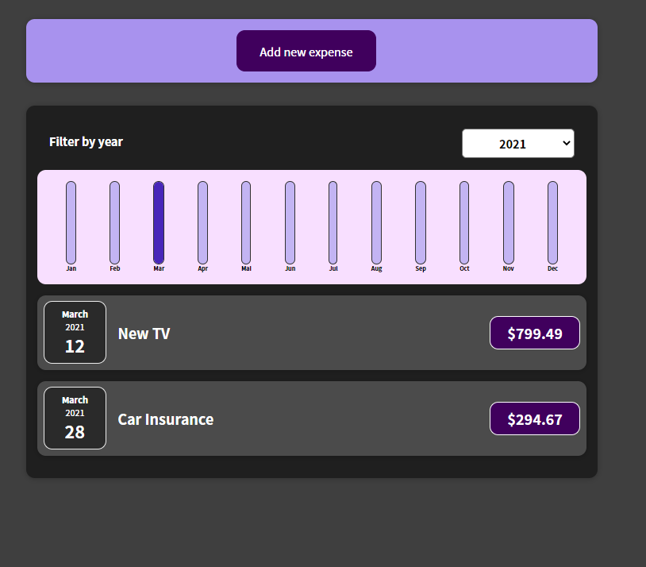
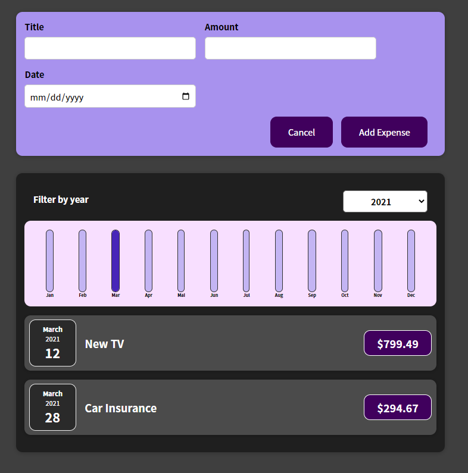
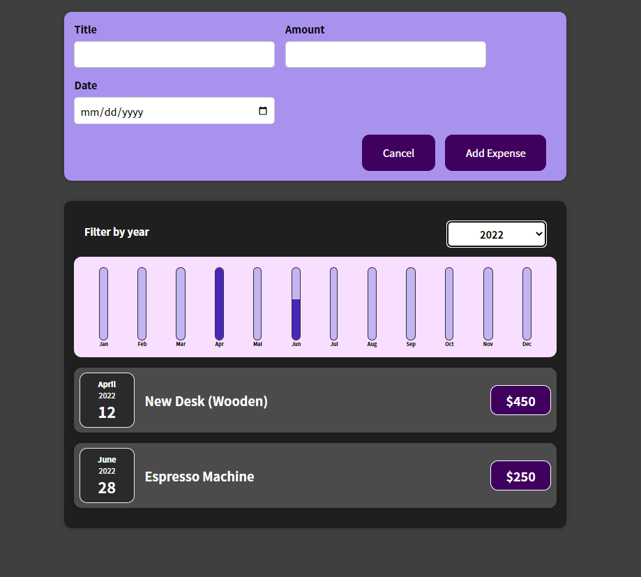
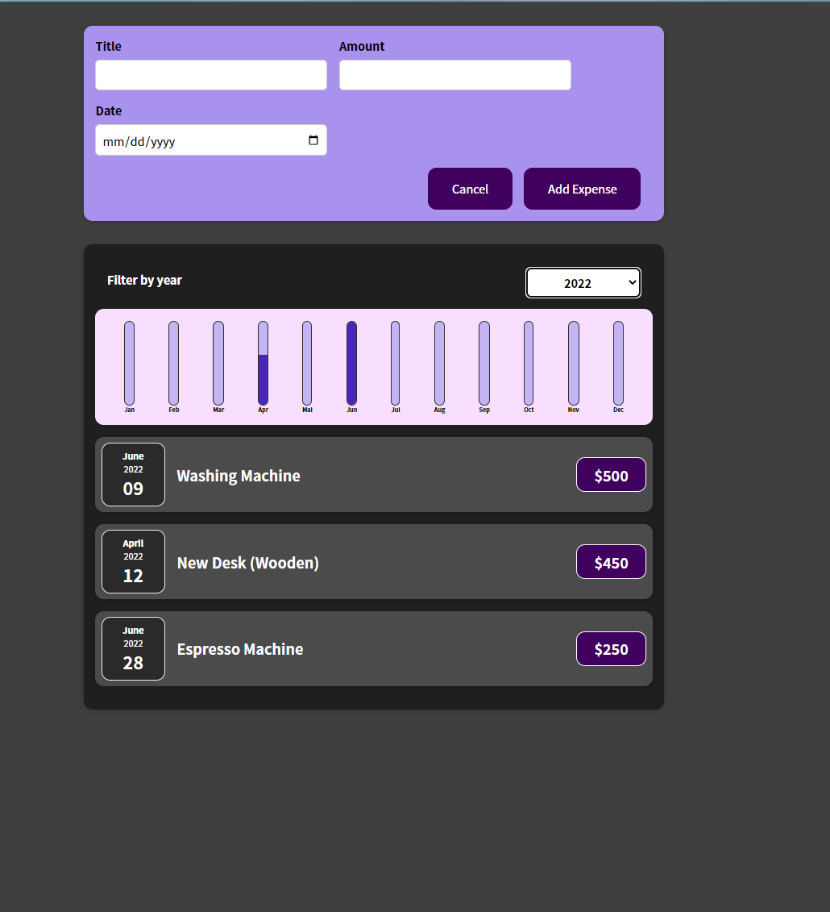
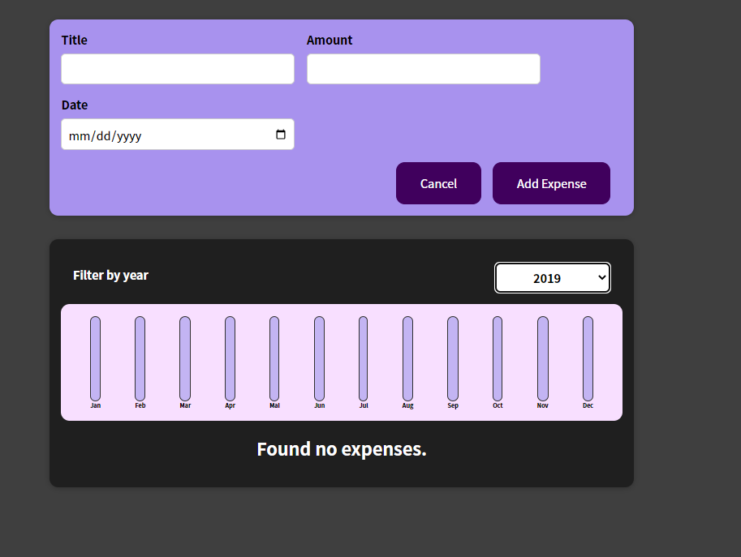

# Expense Tracker

First project built during the course "Complete guide to React". 

## Description

We can filter our expenses by year and see how much has been spent each month.

_What the expense tracker looks like_

_We can add a new expense or cancel it_

_Let's filter by year_

_A new expense has been added and the chart bar has been updated accordingly_

_No expenses found in 2019_
